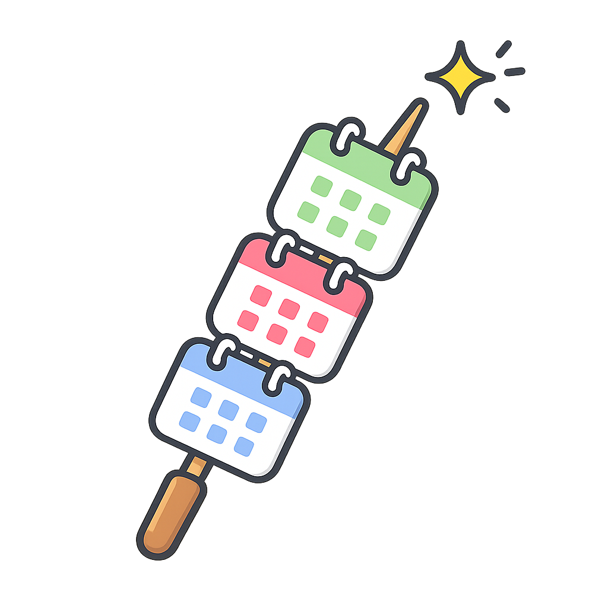
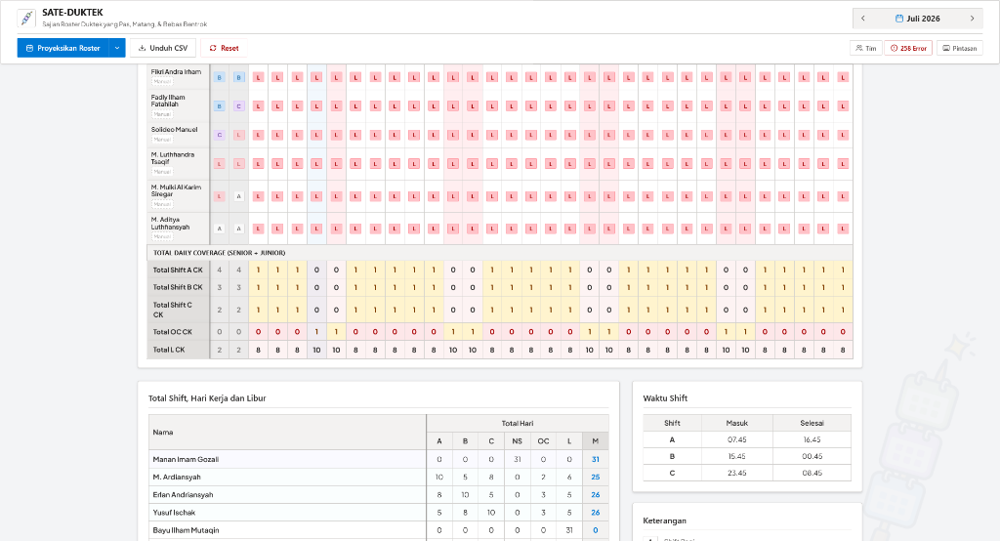
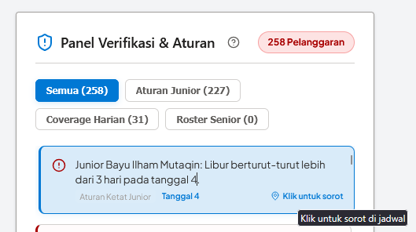

<div align="center">
  
  <h1>SATE-DUKTEK</h1>
  <p><strong>Sajian Roster Duktek yang Pas, Matang, &amp; Bebas Bentrok</strong></p>
  <p>Aplikasi Pembuat Roster Dukungan Teknis Otomatis &amp; Interaktif untuk Tim Support CloudKilat.</p>

  [](https://vuejs.org/)
  [](https://vitejs.dev/)
  [](https://pinia.vuejs.org/)
  [](https://opensource.org/licenses/MIT)
</div>

---

## 📝 Deskripsi Proyek

**SATE-DUKTEK** adalah web application berbasis client-side (*offline-first*) yang dirancang khusus untuk mempermudah penyusunan roster shift kerja bagi tim **Dukungan Teknis (Support) CloudKilat**. 

Dengan memadukan algoritma pencarian cerdas **4-Pass Backtracking** dan panel verifikasi aturan harian yang ketat, aplikasi ini memastikan penyusunan jadwal kerja bulanan untuk **Leader, 3 Senior, dan 8 Junior Support** selesai dalam hitungan milidetik secara adil, merata, dan **100% bebas dari bentrokan/pelanggaran aturan**.

---

## ✨ Fitur Utama

- 🧠 **Penyusunan Roster Otomatis (4-Pass Backtracking Engine)**: Membuat jadwal bulanan yang mematuhi batasan pola shift personal, pembatasan berturut-turut, dan kapasitas harian secara instan.
- 📋 **Panel Verifikasi Aturan & Deteksi Error Reaktif**: Sistem melakukan audit otomatis secara real-time dan mendeteksi jika terjadi pelanggaran aturan (misalnya: penumpukan shift, rotasi salah, atau kurang personel).
- 📍 **Sorotan Kesalahan Interaktif (Interactive Scroll & Center)**: Klik kartu kesalahan pada panel verifikasi untuk langsung mengarahkan, menyorot, dan menyelaraskan posisi tabel tepat di sel/kolom yang bermasalah (dilengkapi *offset* anti tertutup *sticky header*).
- 👥 **Kelola Nama & Metadata Anggota Tim secara Inline**: Edit nama Leader, Senior, dan Junior Support langsung di tempat. Dilengkapi proteksi anti-nama duplikat dan inisialisasi jadwal reaktif.
- 📆 **Proyeksi Roster Multi-Bulan**: Buat jadwal beruntun hingga 24 bulan ke depan dengan visualisasi loading progress real-time. Sistem membawa riwayat shift bulan lalu secara otomatis demi kontinuitas.
- 📥 **Ekspor CSV Rapi (Spreadsheet-Friendly)**: Unduh data roster bulan berjalan atau rentang bulan kustom sekaligus dengan format CSV yang bersih untuk diimpor ke Microsoft Excel atau Google Sheets.
- ⌨️ **Navigasi Keyboard Cepat**: Berpindah bulan secara instan tanpa menyentuh mouse menggunakan tombol `PageUp` / `PageDown` atau kombinasi `Alt` + `←` / `→`.
- 🔒 **Offline-First & Aman (Local Storage)**: Seluruh data Anda disimpan secara lokal di browser Anda. Aman dari kebocoran data eksternal.

---

## 📸 Tampilan Aplikasi

### Matriks Roster Utama & Hasil Proyeksi
Tabel roster interaktif SharePoint-style yang memuat jadwal Leader (selalu non-shift/NS), Senior, Junior, dan baris total harian coverage (dengan highlight kapasitas aman).


### Panel Verifikasi Aturan & Deteksi Pelanggaran
Sistem mendeteksi dan merinci setiap pelanggaran aturan shift secara reaktif dengan fitur klik untuk langsung mengarahkan tampilan layar ke sel yang bermasalah.


---

## 🛠️ Logika Bisnis & Aturan Roster

SATE-DUKTEK menguji roster terhadap serangkaian batasan ketat untuk menjamin kesehatan staf dan kelancaran operasional:

### 1. Aturan Ketat Junior Support
- **Maksimal Kerja Berturut-turut**: Maksimal 5 hari kerja berturut-turut dalam satu siklus kerja.
- **Minimal Libur Berturut-turut**: Minimal 2 hari libur berturut-turut setelah masa kerja selesai (pola 5-2).
- **Transisi Shift Aman**: Tidak diperbolehkan rotasi shift mundur yang membahayakan kesehatan (B ke A, C ke A, C ke B dalam 24 jam).
- **Kepatuhan Pola**: Roster junior harus mematuhi salah satu pola rotasi resmi bulanan (seperti `AABBC`, `AAABC`, `AABCC`, `ABBBC`, `ABBCC`).

### 2. Kapasitas & Coverage Harian
- **Prioritas Urutan Shift (Weekday)**: Jumlah personel harian di hari kerja wajib mengikuti urutan: `Shift A (Pagi) >= Shift B (Sore) >= Shift C (Malam)`, dengan syarat mutlak `Shift A >= 2` Junior.
- **Beban Akhir Pekan Seimbang**: Membatasi maksimal 2 Junior pada Shift A akhir pekan untuk mencegah penumpukan tugas di hari Sabtu/Minggu.
- **Roster Senior Support**: Senior dirotasi secara otomatis berdasarkan indeks kuartalan Q1 (weekday) dan dijadwalkan secara bergantian untuk mengawal operasional (*on-call/OC*) di akhir pekan.

---

## 🚀 Cara Menjalankan Proyek

Aplikasi ini dibangun menggunakan Vue 3, Vite, dan Pinia. Anda memerlukan **Node.js** (versi 18 ke atas) terinstall di perangkat Anda.

### 1. Kloning Repositori
```bash
git clone https://github.com/mbahnizen/sate-duktek.git
cd sate-duktek
```

### 2. Instalasi Dependensi
```bash
npm install
```

### 3. Jalankan Server Dev Lokal
Jalankan dev server lokal untuk pengembangan/pengujian:
```bash
npm run dev
```
Buka tautan lokal yang tertera di terminal Anda (biasanya `http://localhost:5173`) di browser.

### 4. Build untuk Produksi
Lakukan kompilasi aset untuk deployment produksi:
```bash
npm run build
```
Hasil build yang dioptimalkan akan berada di folder `/dist` dan siap diunggah ke hosting statis pilihan Anda (GitHub Pages, Netlify, Vercel, dll.).

---

## 🏗️ Teknologi Stack

- **Framework Utama**: Vue 3 (Composition API dengan `<script setup>`)
- **State Management**: Pinia (Store Reaktif)
- **Styling**: Vanilla CSS (Microsoft Fluent / SharePoint UI Aesthetic)
- **Bundler & Tooling**: Vite 8 & npm
- **Library Ikon**: Lucide Vue Next

---

## 📄 Lisensi

Proyek ini dilisensikan di bawah lisensi MIT - lihat file [LICENSE](LICENSE) untuk detail lebih lanjut.
